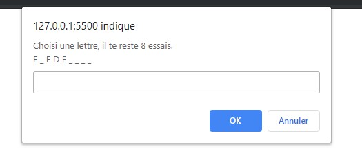
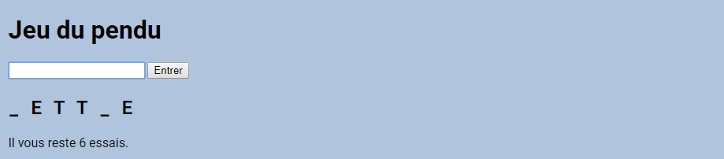
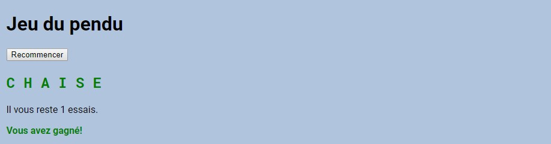
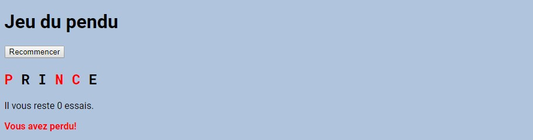
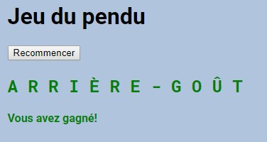
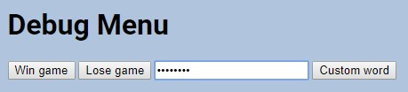

# Jeu du pendu

- Projet solo par Frédérick Van Isschot
- Formation: BeCode
- Mai-Juin 2019
- HTML, CSS et JavaScript

## Le simple exercice
C'était à la base juste un petit exercice ou il fallait juste faire un `prompt` pour demander à la personne de choisir une lettre et d'afficher à la console les lettres devinés avec un nombre d'essais limités.

## Plus loin que ce qui avait été demandé

J'ai commencé par aller plus loin en utilisant la page HTML entrer une lettre et afficher les lettres devinés sur cette même page. (on n'avais pas encore évoqué le DOM au cours)

Puis j'ai encore été plus loin en indiquant les lettres qu'on n'a pas trouvées en rouge.

Pour finir, j'ai fais une petite liste de mots dans un tableau qui sera choisi aléatoirement en début de partie. Il ne contenait qu'une petite dizaine de mots.

## L'approfondissement de l'exercice
Cet exercice est resté en suspens du 21 mai au 12 juin, on a eu beaucoup d'autres exercices entre temps. Comme j'avais terminés les autres exercices, j'ai décidé de revenir sur ce jeu du pendu pour apporter encore plus de fonctionalités.

### Le bonhomme
J'ai d'abord ajouté un bonhomme qui remplace l'indicateur d'essais classique. C'est un SVG que j'ai dessiné moi-même sur Illustrator et que j'affiche les éléments au fur et à mesure qu'on rate des essais.

### Des mots complexes
Ensuite, j'ai fais en sorte que mon jeu puisse gérer les espace, traits d'union, apostrophe et qu'il accepte les lettres à accens malgré qu'on aie tapé une lettre normale

### Un dictionnaire géant
En cherchant sur internet, j'ai trouvé un générateur de mots aléatoire qui contiens un tableau avec plus de 3000 mots dans son JavaScript, j'ai repris sa ligne de code et collé dans mon script mais vu la taille du machin, mon script (ainsi que Visual Studio Code) présentait des difficultés.

J'ai donc appliqué ce que j'ai vu sur l'AJAX, j'ai mis toute la liste dans un fichier JSON séparé et fait une requête `XMLHttpRequest` pour le chercher.

Désormais, mon jeu à plus de 3000 mots aléatoire.

### Encore plus de fonctionalités
Un de mes collègues m'a suggéré d'afficher les lettres tapés, je l'ai donc appliqué et je me suis aussi amusé à ajouter un menu caché qui peut être affiché après avoir tapé un *code de triche* avec les touches flèchées

### Un bonhomme expressif
Je me suis amusé à rajouter des détails à mon bonhomme en lui ajoutant des expression au fur et à mesure qu'on se trompe

